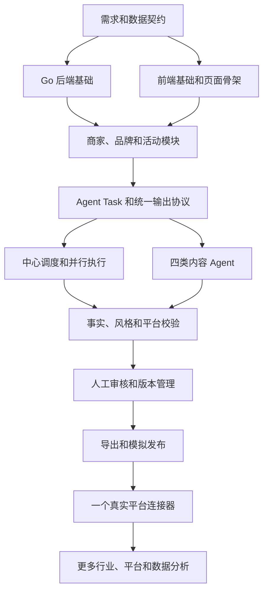

# A to A 项目整体路线与双人协作规范

## 1. 文档信息

| 项目 | 内容 |
| --- | --- |
| 项目名称 | A to A 多行业商家营销内容协同平台 |
| 文档名称 | 项目整体路线与双人协作规范 |
| 文档版本 | v0.1 |
| 适用成员 | 项目负责人、BerylEric |
| 主仓库 | https://github.com/yushangcan/A_to_A |
| 主分支 | `main` |
| 当前基线 | `842ebe1 docs: add product requirements` |

本文档同时解决两个问题：

1. 项目应该按照什么顺序逐步完成。
2. 项目负责人和 BerylEric 如何分工、开发、评审和合并代码。

## 2. 项目目标

A to A 面向餐饮、美业、实体零售、电商、教育培训、家政、摄影、健身等需要线上获客和活动推广的中小商家。

商家输入一次店铺信息和活动信息，系统基于统一的品牌档案，生成不同内容场景下的营销素材：

- 小红书种草笔记、标题和标签。
- 抖音、视频号或 B 站使用的短视频脚本、口播台词和分镜。
- 朋友圈短文案、活动配文和海报文字。
- 真实评价邀请、售后回访话术和差评回复草稿。

系统的第一版不追求四个平台全部真实发布，而是先完成：

```
商家资料
    -> 品牌档案
    -> 活动 Brief
    -> 中心调度
    -> 四类内容生成
    -> 事实和风格校验
    -> 人工确认
    -> 复制、导出或模拟发布
```

## 3. 总体开发原则

### 3.1 先完成闭环，再扩大范围

每个模块都必须完成以下闭环后，才能进入下一个模块：

```
需求确认
    -> 数据设计
    -> API 设计
    -> 实现
    -> 测试
    -> 文档更新
    -> Git 提交
    -> 代码评审和合并
```

### 3.2 核心能力通用化，行业内容配置化

系统核心不绑定餐饮行业。通用字段包括店铺名称、产品或服务、活动时间、价格、目标客户和联系方式；餐饮、美业、电商等行业差异通过行业字段、模板、示例和校验规则实现。

### 3.3 Agent 是逻辑模块，不是第一天就拆开的微服务

第一版四个 Agent 放在同一个代码仓库中，通过统一接口调用。不要一开始创建四个独立服务、四个部署环境和四套数据库。

### 3.4 所有重要事实必须可追溯

价格、活动日期、地址、联系方式、商品名称和服务承诺等内容必须来自商家输入或已确认的品牌档案。模型不得自行编造，发布前必须经过程序校验和人工确认。

### 3.5 主分支保持可运行

`main` 只接受已经测试和评审过的改动。个人开发在功能分支进行，不能直接在 `main` 上试验或提交未完成代码。

## 4. 项目依赖关系



前端骨架和后端基础可以并行，但它们必须先共同确定 API 契约和字段名称。Agent 开发不能早于 `CampaignBrief`、`BrandProfile` 和 `AgentResult` 的数据结构确定。

## 5. 分阶段完成路线

### Phase 0：项目基线和协作准备

状态：已完成基础仓库和 PRD，协作规范在本次提交中补充。

目标：保证两个人从同一份可回退代码开始。

交付物：

- GitHub 公开仓库。
- `docs/PRD.md`。
- 本文档 `docs/TEAM_COLLABORATION.md`。
- `main` 分支基线提交。
- GitHub 协作者权限。

验收标准：

- 两个人都可以克隆仓库。
- 两个人都能在本地看到同一个 `main` 提交。
- 仓库不包含密码、Token、个人配置和本地数据库文件。

### Phase 1：需求、领域模型和 API 契约

目标：在写业务代码前，把系统中的对象和状态定义清楚。

需要确定的对象：

```
User
Merchant
BrandProfile
IndustryProfile
Campaign
Asset
AgentTask
ContentArtifact
ApprovalRecord
PublishTask
AuditLog
```

需要确定的状态：

```
Campaign:
DRAFT -> GENERATING -> WAITING_REVIEW -> APPROVED -> COMPLETED

AgentTask:
PENDING -> RUNNING -> SUCCEEDED / RETRYING / FAILED

PublishTask:
CREATED -> VALIDATING -> PUBLISHING -> SUCCESS / FAILED / EXPORTED
```

主要交付物：

- 数据模型文档。
- API 草案。
- Agent 输入输出 JSON 示例。
- 状态流转图。
- 一条完整的活动示例数据。

完成标准：

- 两个人可以根据文档独立理解一条活动如何从输入变成最终内容。
- API 字段命名、状态值和错误格式已经统一。
- 后续编码不再因为字段含义不清反复修改数据库。

### Phase 2：后端基础和商家模块

负责人：项目负责人。

目标：搭建可运行的 Go 后端，并完成用户、商家和品牌档案闭环。

主要任务：

- Go + Gin 服务初始化。
- 配置文件和环境变量管理。
- MySQL 连接和迁移。
- 用户注册、登录和基础鉴权。
- 商家工作区创建和查询。
- 品牌档案创建、编辑和查询。
- 行业配置的基础读取。
- 统一错误返回和日志格式。

BerylEric 的协作任务：

- 根据 API 契约准备前端请求模型。
- 设计品牌档案页面和商家资料页面。
- 编写表单字段和校验清单。
- 使用固定 Mock 数据验证页面展示。

完成标准：

- 可以注册、登录并创建商家工作区。
- 可以保存品牌语气、卖点、禁用词和联系方式。
- 后端接口有基本测试。
- 前端可以展示和编辑品牌档案。

### Phase 3：活动 Brief 和素材模块

负责人：项目负责人主责，BerylEric 负责页面和素材展示。

目标：完成商家输入一次活动信息的闭环。

主要任务：

- 创建、编辑和保存活动草稿。
- 保存商品或服务、时间、价格、规则和目标客户。
- 支持行业扩展字段。
- 建立图片素材记录。
- 保存活动历史版本。
- 支持基于历史活动复制新活动。

BerylEric 的协作任务：

- 创建活动表单。
- 展示行业相关字段。
- 图片选择、预览和删除交互。
- 活动草稿和历史页面。

完成标准：

- 用户可以创建一条完整的活动 Brief。
- 数据库中可以准确保存活动事实。
- 同一活动可以被后续四个 Agent 共同读取。
- 价格、日期、地址和联系方式有明确字段，不只放在一段自然语言中。

### Phase 4：Agent 统一协议和中心调度

负责人：项目负责人负责调度和任务状态，BerylEric 负责 Agent 输入输出和内容模板。

目标：让四个 Agent 在同一份输入和输出规范下运行。

统一输入：

```
BrandProfile
IndustryProfile
CampaignBrief
TargetPlatform
OutputSchema
HardConstraints
```

统一输出：

```json
{
  "agent_type": "xiaohongshu",
  "platform": "xiaohongshu",
  "title_candidates": [],
  "content": "",
  "tags": [],
  "assets": [],
  "facts_used": [],
  "warnings": [],
  "requires_human_review": false
}
```

项目负责人任务：

- 创建 Agent Task 数据表和状态机。
- 保存任务输入、输出、错误和重试次数。
- 实现中心调度器。
- 使用 Go 协程或 `errgroup` 并行运行四个任务。
- 设置任务超时、幂等键和失败状态。

BerylEric 任务：

- 编写四类 Agent 的输入组装逻辑。
- 编写 Prompt 模板和行业示例。
- 编写结构化 JSON 解析。
- 为每个 Agent 准备最小可用 Mock 输出。
- 记录每个 Agent 的输出字段说明。

完成标准：

- 点击一次生成，可以创建四个独立任务。
- 四个任务可以并行运行。
- 一个任务失败时，其他任务结果不会被删除。
- 所有结果都能按照统一协议保存。

### Phase 5：四个内容 Agent

负责人：BerylEric 主责，项目负责人负责接口、存储和集成。

#### 小红书 Agent

输出标题、种草笔记、封面文字、图片顺序、话题标签和评论区引导。

#### 短视频 Agent

输出视频主题、前三秒开场、口播台词、分镜、字幕、标题和行动引导。

#### 朋友圈 Agent

输出短活动文案、熟人推荐文案、客户通知文案和海报配文。

#### 评价管理 Agent

输出真实评价邀请、售后回访话术、差评回复和投诉分类。

禁止生成虚假客户评价、虚构消费经历、虚构客户身份和未经确认的赔偿承诺。

项目负责人任务：

- 提供统一 Agent 接口。
- 提供 Mock LLM Gateway，确保没有模型服务时也能跑测试。
- 保存模型调用耗时、错误和版本信息。
- 完成 Agent Task 与 Content Artifact 的持久化。

BerylEric 任务：

- 完成四个 Agent 的生成逻辑。
- 准备餐饮、美业、零售和电商的最小示例。
- 为每个 Agent 编写至少一组成功样例和失败样例。
- 保证模型输出不能绕过结构化解析。

完成标准：

- 每个 Agent 都有明确输入、输出和错误处理。
- 每个 Agent 至少有单元测试或固定样例测试。
- 生成结果能在前端按内容类型展示。
- 关键事实能够回溯到活动 Brief。

### Phase 6：事实、风格和平台校验

负责人：项目负责人负责硬规则，BerylEric 负责内容规则和展示。

程序化硬校验：

- 价格是否一致。
- 活动日期是否一致。
- 店铺名称是否一致。
- 地址和联系方式是否一致。
- 禁用词是否出现。
- 标题和正文是否超长。
- 是否缺少图片或视频。
- 是否缺少平台必填字段。

模型辅助软校验：

- 是否符合品牌语气。
- 是否过度营销。
- 是否包含夸大承诺。
- 是否适合目标人群。
- 是否需要人工复核。

项目负责人任务：

- 实现事实提取和比较。
- 实现禁用词和必填字段校验。
- 设计统一 `ValidationIssue` 结构。
- 实现校验失败后的有限重试。

BerylEric 任务：

- 编写风格校验规则和提示模板。
- 设计警告文案和严重程度。
- 在前端展示错误、警告和建议。
- 为每类校验准备测试样例。

完成标准：

- 价格从 99 元被模型改成 89 元时可以被发现。
- 缺少封面或视频时可以明确提示。
- 严重错误会阻止确认，普通建议可以由商家选择忽略。
- 校验结果可以在页面中定位到具体内容。

### Phase 7：内容工作区和人工确认

负责人：BerylEric 主责，项目负责人负责接口和权限。

目标：让商家能够查看、修改和确认生成结果。

主要页面：

- 内容生成进度页。
- 多平台结果页。
- 单个平台编辑页。
- 校验警告面板。
- 原始版本和修改版本对比。
- 全部确认页。

主要功能：

- 按平台切换内容。
- 编辑标题、正文、标签和分镜。
- 单独重新生成某个平台。
- 保存用户修改版本。
- 确认单个平台或全部内容。
- 未处理严重错误时禁止确认。

完成标准：

- 商家可以不重新生成其他平台，只修改一个平台。
- 用户修改后的版本与模型原始版本同时保存。
- 只有确认后的版本可以进入发布或导出任务。

### Phase 8：复制、导出和模拟发布

负责人：项目负责人主责，BerylEric 负责交互和结果展示。

目标：先实现不依赖第三方平台权限的完整发布闭环。

主要任务：

- 复制标题、正文和标签。
- 导出 TXT、Markdown 或 JSON 内容包。
- 创建模拟发布任务。
- 为每个平台生成模拟外部 ID 和虚拟链接。
- 保存发布时间、内容版本和任务结果。
- 支持只重试失败平台。

发布模式：

```
SIMULATED       模拟发布
MANUAL_EXPORT   手动导出
OFFICIAL_API    官方 API，后续扩展
```

完成标准：

- 四个平台可以独立生成发布任务。
- 一个任务失败不会影响其他任务。
- 发布历史可以查询。
- 重复点击不会创建相同的重复发布任务。

### Phase 9：第一个真实平台连接器

负责人：项目负责人主责，BerylEric 负责测试和文档。

目标：在确认官方文档、账号权限和接口可用性后，只选择一个平台进行真实接入。

主要任务：

- 平台账号授权。
- Token 加密保存。
- 平台专属 Payload 组装。
- 官方 API 请求和响应解析。
- 外部错误码转换。
- 超时、重试和幂等处理。
- 发布记录和外部链接保存。

约束：

- 不保存第三方平台密码。
- 不使用绕过验证码的网页登录自动化。
- 不假设所有平台都有相同的发布 API。
- 真实发布前必须保留人工确认。

### Phase 10：行业包、数据分析和产品化

目标：扩大可服务行业，并验证产品是否真的降低商家内容产出成本。

主要任务：

- 餐饮行业配置包。
- 美业行业配置包。
- 实体零售行业配置包。
- 电商行业配置包。
- 内容模板管理。
- 生成耗时和成本统计。
- 人工修改比例统计。
- 内容采用率和复用率统计。
- 账号授权和团队协作。
- 定时发布和更多平台。

## 6. 双人职责分工

以下是默认分工。职责可以根据实际能力调整，但每个模块必须明确一个主负责人和一个评审人，不能出现“大家都负责但没人交付”的状态。

### 6.1 项目负责人

主要角色：项目负责人、Go 后端负责人、系统集成负责人。

负责：

- PRD 和总体架构维护。
- 数据库设计和迁移。
- Go Gin 服务基础设施。
- 用户、商家、品牌和活动 API。
- Agent Task 状态机和中心调度器。
- 并行执行、超时、重试和幂等。
- 事实校验和发布任务。
- 官方平台连接器。
- 集成测试、部署和 GitHub 仓库维护。
- 最终版本发布和风险决策。

### 6.2 BerylEric

主要角色：Agent 内容负责人、前端和内容体验负责人。

负责：

- 四个内容 Agent 的提示词和生成逻辑。
- 行业内容示例和平台风格规则。
- 结构化 Agent 输出和失败样例。
- 内容工作区和审核页面。
- 标题、正文、标签、分镜的编辑体验。
- 风格校验提示和警告展示。
- 前端 API 对接和页面测试。
- 内容质量测试和用户操作说明。

### 6.3 共同负责

- Phase 1 数据模型和 API 契约。
- Agent 输入输出协议。
- 事实一致性规则。
- 评价管理合规边界。
- 重大架构调整。
- 发布前验收。
- 真实商家使用反馈。

## 7. 模块责任矩阵

| 模块 | 项目负责人 | BerylEric | 最终主责 |
| --- | --- | --- | --- |
| PRD 和总体架构 | 负责 | 评审 | 项目负责人 |
| 数据库和迁移 | 负责 | 评审 | 项目负责人 |
| Go API 基础 | 负责 | 联调 | 项目负责人 |
| 商家、品牌、活动模块 | 负责 | 前端联调 | 项目负责人 |
| Agent 接口协议 | 负责 | 负责示例 | 共同确认 |
| 四个内容 Agent | 接口和存储 | 负责实现 | BerylEric |
| 硬规则校验 | 负责实现 | 提供案例 | 项目负责人 |
| 风格校验和提示 | 集成 | 负责规则 | BerylEric |
| 内容编辑工作区 | API | 负责页面 | BerylEric |
| 模拟发布和导出 | 负责 | 负责交互 | 项目负责人 |
| 真实平台连接器 | 负责 | 测试和文档 | 项目负责人 |
| 测试和验收 | 共同 | 共同 | 提交者先自测 |
| GitHub 仓库和发布 | 负责 | 协作 | 项目负责人 |

## 8. 代码目录责任边界

建议按以下方式减少文件冲突：

```
docs/
  PRD.md
  TEAM_COLLABORATION.md

cmd/
  server/                         项目负责人

internal/config/                  项目负责人
internal/database/                项目负责人
internal/models/                  项目负责人
internal/api/                     项目负责人主责，BerylEric 联调
internal/merchant/                项目负责人
internal/brand/                   项目负责人
internal/campaign/                项目负责人
internal/orchestrator/            项目负责人
internal/validator/               双方共同
internal/publishing/              项目负责人

internal/agent/                   BerylEric 主责
  xiaohongshu/
  video_script/
  moments/
  review/

web/                              BerylEric 主责
tests/                            双方共同
```

如果一个功能必须同时修改双方负责的目录，应先在 Issue 或 PR 描述中说明修改原因和接口影响，避免直接覆盖对方未合并的工作。

## 9. Git 和 GitHub 协作流程

### 9.1 分支规则

```
main                           可运行、可发布的稳定分支
codex/backend-merchant         商家和品牌后端
codex/backend-campaign         活动和素材后端
codex/orchestrator-tasks       调度和任务状态
codex/beryl-agents             四类 Agent
codex/beryl-content-workspace  内容编辑页面
codex/validation-publishing    校验和发布
```

分支名应说明模块，不使用 `test`、`new`、`temp` 等无法判断用途的名称。

### 9.2 开始一个任务

两个人都按照以下流程操作：

```powershell
git switch main
git pull --ff-only origin main
git switch -c codex/<task-name>
```

如果本地有未完成修改，不要直接切换分支。先提交临时检查点或与对方沟通。

### 9.3 提交规则

一次提交只表达一个清晰目的：

```
feat(brand): add brand profile APIs
feat(agent): add xiaohongshu output schema
feat(campaign): add campaign draft persistence
fix(validator): reject inconsistent promotion price
docs(team): add collaboration workflow
test(agent): add review response fixtures
```

每个实验分支必须至少有一个可回退的 Git 提交，不能只在工作区保留重要改动。

### 9.4 提交前检查

后端代码提交前：

```powershell
go test ./...
go vet ./...
git diff --check
git status --short
```

前端代码提交前：

```powershell
npm run build
git diff --check
git status --short
```

文档提交前：

```powershell
git diff --check
```

### 9.5 Pull Request 规则

- 不直接向 `main` 推送功能代码。
- 每个功能分支都通过 Pull Request 合并。
- PR 标题说明模块和动作。
- PR 描述必须包含变更内容、验证命令、已知问题和下一步工作。
- 提交者先自测，另一人负责至少一次代码或文档评审。
- 评审人发现问题时，应在 PR 中具体指出文件、逻辑和修改建议。
- 合并后删除已完成的功能分支。

## 10. 任务分配和状态规范

GitHub Issue 使用以下字段：

```
模块：backend / agent / frontend / validation / publishing / docs
优先级：P0 / P1 / P2
负责人：项目负责人 / BerylEric
评审人：项目负责人 / BerylEric
依赖：Issue 编号或 none
验收标准：可执行的检查项
```

任务状态：

```
Todo
In Progress
Review
Blocked
Done
```

一个任务进入 `Done` 前必须满足：

- 代码或文档已经提交。
- 相关测试已经运行。
- PR 已评审并合并。
- 文档和 API 示例已经同步。
- 没有把密码、Token、日志和本地数据库提交到仓库。

## 11. 每个阶段的协作节奏

### 开始前

- 确认本阶段目标。
- 明确主负责人和评审人。
- 确认依赖的 API 和数据结构。
- 建立 GitHub Issue。

### 开发中

- 每完成一个可运行的小单元就提交。
- 遇到接口变化先在 PR 或 Issue 中说明。
- 不直接修改对方正在开发的核心文件。
- 使用固定 Mock 数据保证另一方可以独立联调。

### 提交前

- 主负责人完成本地测试。
- 检查 diff 是否只包含当前任务。
- 更新 API 示例或文档。
- 推送功能分支并创建 PR。

### 评审时

- 先检查功能是否满足验收标准。
- 再检查错误处理、边界条件和安全问题。
- 最后检查代码结构和命名。
- 评审意见必须可执行，不使用“感觉不太好”这类无法操作的描述。

### 合并后

- 拉取最新 `main`。
- 验证本地仍能启动和测试。
- 关闭对应 Issue。
- 删除已完成的本地和远程功能分支。

## 12. 第一轮实际执行顺序

当前 PRD 和协作文档完成后，第一轮建议按以下顺序进行：

### 第一个闭环：数据契约

项目负责人：

- 建立 `BrandProfile`、`CampaignBrief`、`AgentTask`、`AgentResult` 数据结构。
- 建立活动和 Agent 任务状态。
- 提供一份示例 JSON。

BerylEric：

- 审核字段是否能够支持四类内容。
- 补充每个 Agent 的输出示例。
- 标记缺失字段和不合理字段。

交付：数据模型文档和示例数据。

### 第二个闭环：商家和品牌档案

项目负责人：

- 后端表和 API。
- 数据库迁移。
- 基础接口测试。

BerylEric：

- 品牌档案页面。
- 表单校验。
- API 联调。

交付：可以保存和读取一个商家的品牌档案。

### 第三个闭环：活动输入

项目负责人：

- 活动表和 CRUD API。
- 行业扩展字段保存。
- 图片素材记录。

BerylEric：

- 活动创建和编辑页面。
- 图片预览。
- 活动状态展示。

交付：可以保存一条完整活动 Brief。

### 第四个闭环：Mock Agent 调度

项目负责人：

- 中心调度器。
- 并行任务。
- 任务状态和错误处理。

BerylEric：

- 四个 Mock Agent。
- 统一结果展示。
- 生成进度页面。

交付：点击一次后四个 Agent 都能返回可展示结果。

### 第五个闭环：校验、审核和模拟发布

项目负责人：

- 硬规则校验。
- 审核状态。
- 模拟发布和历史记录。

BerylEric：

- 内容编辑页面。
- 警告展示。
- 复制和导出交互。

交付：从活动输入到模拟发布完成的完整闭环。

## 13. 质量和安全底线

- 不提交真实 API Key、Token、密码或 Cookie。
- 不把 `.env`、本地数据库、IDE 配置和日志提交到仓库。
- 不让模型直接绕过校验器写入发布记录。
- 不自动编造客户评价和客户见证。
- 不把网页登录自动化当作默认平台接入方式。
- 不为了展示多 Agent 而引入无法解释的无限循环。
- 所有价格、日期、地址和联系方式必须经过事实校验。
- 真实发布必须由商家确认最终版本。

## 14. 项目阶段性版本

### v0.1：可运行内容生成闭环

- 商家和品牌档案。
- 活动 Brief。
- 四个 Mock Agent。
- 统一输出。
- 基础校验。
- 内容编辑。
- 复制、导出和模拟发布。

### v0.2：可复用和可协作

- 行业配置包。
- 活动历史。
- 多人协作。
- 更完整的权限和审计。
- Prompt 和模板管理。

### v0.3：一个真实平台

- 官方授权。
- 一个真实平台发布器。
- 外部 ID 和链接保存。
- 发布失败重试。

### v0.4：产品化扩展

- 更多平台。
- 定时发布。
- 图片和海报生成。
- 生成成本和效果分析。
- 更多行业模板。

## 15. 当前阶段验收清单

- [x] 公开 GitHub 仓库已建立。
- [x] `docs/PRD.md` 已提交。
- [ ] `docs/TEAM_COLLABORATION.md` 已提交并推送。
- [ ] 两位成员都能克隆和运行仓库。
- [ ] Phase 1 数据契约已经确认。
- [ ] 第一个功能分支已建立。
- [ ] 第一个模块已完成测试和 PR 评审。
